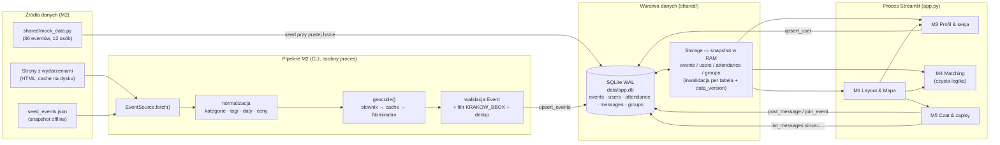
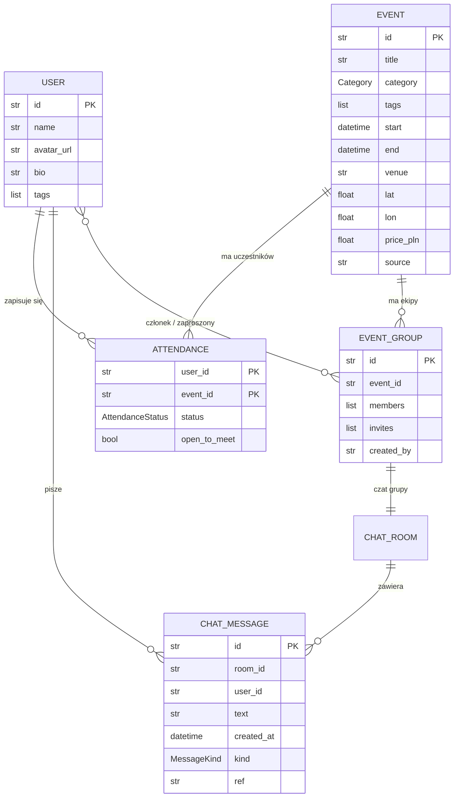
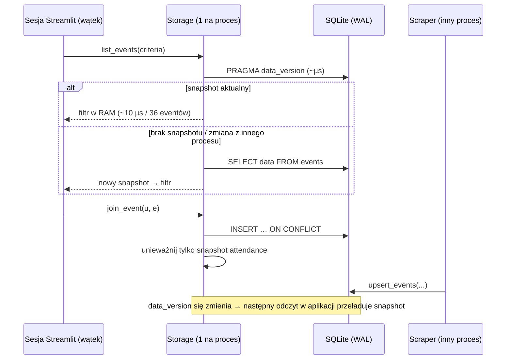
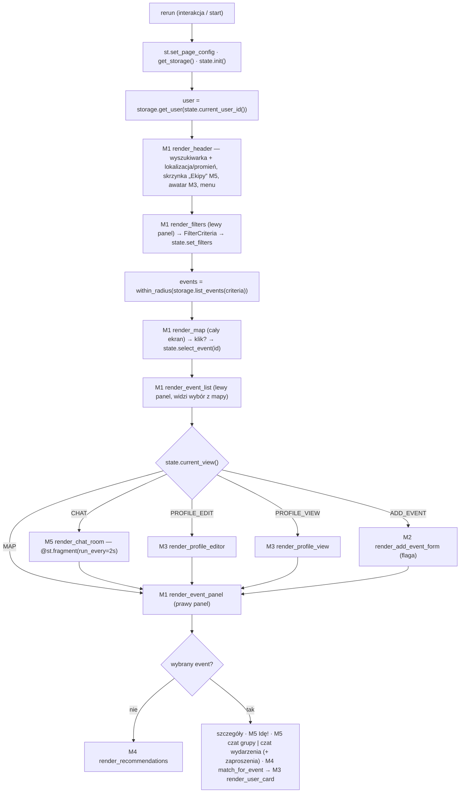
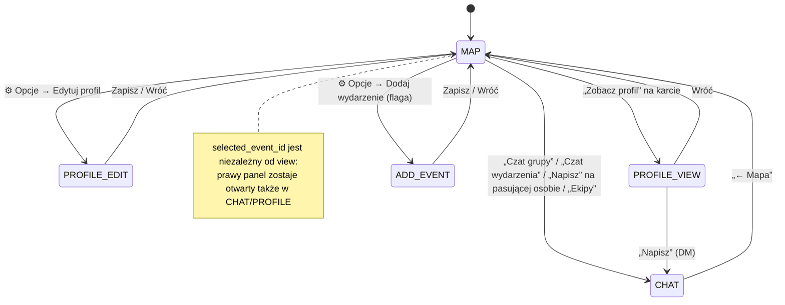
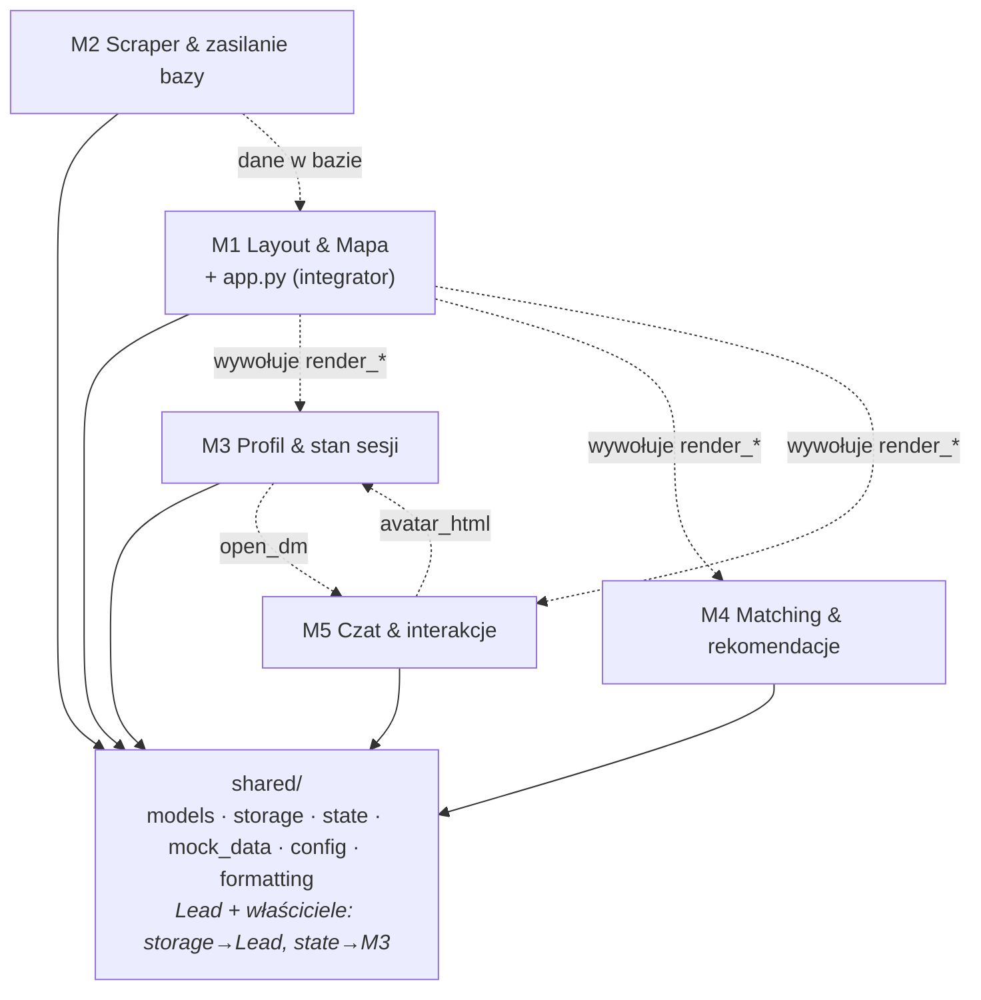

# ARCHITECTURE — KRK Razem (HackYeah 2026)

> Aplikacja webowa (Streamlit) ułatwiająca wspólne wyjścia na wydarzenia kulturalne i społeczne w Krakowie:
> **mapa wydarzeń → szczegóły → osoby o podobnych zainteresowaniach, które też idą → czat.**
> Dokument dla 5-osobowego zespołu na 24-godzinny hackathon. Specyfikacje modułów: `m*/TASK_SPEC.md`.

---

## 1. Założenia MVP

| Zasada | Konsekwencja |
|---|---|
| **Demo > produkcja** | Brak haseł/OAuth (wybór persony + `?user=` w URL), jeden proces Streamlit, SQLite. |
| **Kontrakt najpierw** | `shared/` jest zamrożony od H1; zmiany tylko addytywne (nowe pole = z wartością domyślną). |
| **Walking skeleton od H0** | Każdy moduł ma działającą, naiwną wersję wpiętą w `app.py` → integracja nie czeka do nocy; każdy ulepsza swój kawałek. |
| **Zero lagów w UI** | Odczyty z RAM (µs), mapa nie robi reruna przy przesuwaniu, czat odświeża tylko swój fragment. |
| **Offline-safe demo** | Mocki + snapshot danych scrapera w repo; demo nie zależy od zewnętrznych stron. |

## 2. Stack i decyzje

| Warstwa | Wybór | Dlaczego | Plan B |
|---|---|---|---|
| UI | **Streamlit ≥ 1.50** | Wymóg; `st.fragment`, `st.pills`, `st.popover`, `st.dialog`, `width="stretch"` | — |
| Mapa | **folium + streamlit-folium** | Prawdziwe „pinezki” z ikonami kategorii, tooltipy, klik → `last_object_clicked` | `st.pydeck_chart(on_select="rerun")` — natywna selekcja, WebGL |
| Kafelki | **OpenStreetMap** | Bez klucza API (CartoDB wymaga klucza od folium 0.20) | Hotspot z telefonu |
| Modele | **Pydantic v2** (frozen) | Walidacja danych ze scrapera, JSON in/out za darmo, niemutowalne snapshoty | — |
| Baza | **SQLite (WAL), stdlib** | Zero instalacji, wiele procesów naraz (app + scraper), transakcje | — |
| Cache | **Snapshot w RAM w `Storage`** + `PRAGMA data_version` | Precyzyjna inwalidacja (zapis → czyścimy tylko tę tabelę), działa też poza Streamlitem | `@st.cache_data(ttl=…)` |
| Scraping | **requests + BeautifulSoup** (+ cache HTML) | Najszybsze do napisania i debugowania | Playwright dla stron JS; ręczny JSON |
| Geokodowanie | **słownik miejsc + Nominatim** (+ cache) | Znane miejsca bez sieci, reszta z OSM | Rozszerzenie słownika |
| Testy | **pytest + `streamlit.testing.v1.AppTest`** | Logika + smoke test całej aplikacji i sandboxów bez przeglądarki | — |

**Dlaczego nie DuckDB / TinyDB / `st.session_state` jako baza?** DuckDB blokuje plik dla drugiego procesu (scraper vs aplikacja) i jest zoptymalizowany pod analitykę, nie pod drobne zapisy (czat). TinyDB/JSON nie mają transakcji ani bezpiecznych zapisów współbieżnych. `st.session_state` jest per-karta — czat i zapisy muszą być współdzielone między użytkownikami.

**Dlaczego cache w `Storage`, a nie `@st.cache_data`?** `st.cache_data` zna tylko TTL albo czyszczenie wszystkiego; nasz cache wie, *która tabela* się zmieniła, wykrywa zapisy z innego procesu i działa w scraperze/testach bez runtime'u Streamlit. `st.cache_data`/`st.cache_resource` zostają do kosztownych *obliczeń* w UI (np. budowa mapy).

## 3. Architektura end-to-end



## 4. Warstwa danych

### 4.1 Model danych



Obiekty pochodne (nie są tabelami): `MatchResult` (M4 → UI), `Recommendation` (M4 → UI), `FilterCriteria` (filtry → `Storage.list_events`).
Pokoje czatu to tylko konwencja ID: `group:<group_id>` (czat grupy na wydarzenie), `event:<event_id>` (czat wszystkich
uczestników wydarzenia — obok czatu grupy, w tym samym miejscu, przełącznik „Grupa / Wszyscy”), `dm:<user_a>:<user_b>`
(prywatny 1:1).

### 4.2 Fizyczny schemat (tabele dokumentowe)

```sql
events(id PK, data JSON, updated_at)          users(id PK, data JSON, updated_at)
attendance(user_id, event_id, data JSON, PK(user_id, event_id)) + INDEX(event_id)
messages(id PK, room_id, created_at, data JSON) + INDEX(room_id, created_at)
groups(id PK, event_id, data JSON, updated_at) + INDEX(event_id)      -- EventGroup z zaproszeniami w środku
```

Całe obiekty Pydantic jako JSON → **dodanie pola w modelu = zero migracji**; `extra="ignore"` toleruje stare rekordy, a niepoprawny rekord jest logowany i pomijany (nie wywraca aplikacji).

### 4.3 Ścieżka odczytu/zapisu i inwalidacja



- Jedno połączenie SQLite na proces + `RLock` (sesje Streamlit to wątki jednego procesu).
- Czat nie jest cache'owany — zapytanie po indeksie `(room_id, created_at)` z `since=` (polling przyrostowy).
- Grupy: snapshot jak wyżej, zmiany przez `Storage.update_group(id, change)` — read-modify-write pod blokadą
  w jednej transakcji (dwie karty głosujące naraz nie gubią głosów).
- Zmierzone na szkielecie: 1000 przefiltrowanych `list_events` ≈ 10 ms łącznie.

### 4.4 Grupy na wydarzenia („ekipy”, M5)

| Zasada | Gdzie |
|---|---|
| Czat z profilu = zwykły DM. „Napisz” na karcie **pasującej osoby** i lista **Idą / Interesuje ich** w panelu wydarzenia = zaproszenie do *mojej* grupy na to wydarzenie (powstaje przy pierwszym zaproszeniu) | `m5_chat/group_view.py` |
| Jedna osoba = najwyżej jedna grupa na wydarzenie; przyjęcie innego zaproszenia = wyjście z obecnej | `groups.accept_invite` |
| Nową osobę zatwierdza **każdy** członek (karta głosowania na czacie); zapraszający jest „za” od razu, jeden głos „przeciw” odrzuca | `groups.invite` / `groups.vote` |
| Zaproszona osoba widzi skład grupy, ale **treść czatu dopiero po „Dołącz”**; nad czatem nazwa wydarzenia i rząd awatarów (rośnie z każdą osobą) | `group_view.render_group_head` |
| Czat wszystkich uczestników wydarzenia jest obok czatu grupy: przycisk „Czat wydarzenia” w panelu i przełącznik „Grupa / Wszyscy” w nagłówku czatu (ten sam arkusz) | `group_view.render_event_chat_entry`, `render_chat_switch` |
| Grupę można opuścić; ostatnia osoba ją zamyka, a otwarte głosowania przeliczają się bez niej | `groups.leave_group` |

```mermaid
sequenceDiagram
    participant O as Ola (członek)
    participant K as Kuba (członek)
    participant T as Tomek (zapraszany)
    O->>O: „Zaproś” → Tomek (lista Idą / Pasujące)
    Note over O,K: karta głosowania na czacie: Za 1/2 · czekamy na: Kuba
    K->>K: „Za” → komplet głosów → zaproszenie wysłane
    T->>T: „Ekipy · 1” + toast → podgląd czatu (tylko do odczytu)
    T->>T: „Dołącz” → członek; awatar dochodzi do rzędu u wszystkich (fragment czatu → pełny rerun)
```

## 5. Przepływ w Streamlit

### 5.1 Cykl reruna (`app.py`)



Kluczowy trik: **lista i prawy panel renderują się po mapie**, więc klik w pinezkę ustawia `selected_event_id` i panel pokazuje event w *tym samym* przebiegu — bez dodatkowego `st.rerun()`.
Układ: mapa na cały ekran pod spodem, nad nią pływają (CSS `position: fixed` po klasach `st-key-*`) górny pasek, pasek kategorii, lista (lewo), szczegóły (prawo) i arkusz czatu/profilu/formularza nad listą. Mapa jest zawsze zamontowana — widoki CHAT/PROFILE nie resetują jej widoku.

### 5.2 Stan sesji (`shared/state.py` — jedyne źródło kluczy)

| Klucz | Typ | Pisze | Czyta |
|---|---|---|---|
| `user_id` | `str` (+ `?user=` w URL) | M3 | wszyscy |
| `view` | `View` | M1, M3, M5 | `app.py` |
| `selected_event_id` | `str \| None` | M1 (mapa), M4 (rekomendacje), M3 | M1 panel |
| `filters` | `FilterCriteria` | M1 | M4 (opcjonalnie) |
| `chat_room_id` | `str \| None` | M1, M5 | M5 |
| `viewed_user_id` | `str \| None` | M3 | M3 |

Klucze prywatne modułów mają prefiks `m1_` … `m5_` — brak kolizji między modułami.



## 6. Wydajność — zasady obowiązujące wszystkich

1. **Żadnego SQL w ścieżce renderowania** poza czatem — czytamy przez `Storage` (snapshot w RAM).
2. **Mapa:** stała mapa bazowa + pinezki/promień przez `feature_group_to_add` (filtry nie resetują widoku), `returned_objects` bez bounds/zoom (pan/zoom nie robi reruna), stały `key`, mapa zawsze zamontowana.
3. **Czat:** `@st.fragment(run_every=…)` — co 2 s odświeża się tylko okno czatu, nie cała strona.
4. **Ciężkie obliczenia** (np. IDF w M4, budowa mapy w M1) → `st.cache_resource` / memo kluczowane wersją danych.
5. **Callbacki (`on_click`) zamiast `if st.button(): … st.rerun()`** tam, gdzie się da — jeden rerun zamiast dwóch.
6. Budżet: rerun po interakcji **< 300 ms** lokalnie. M1 ma przełącznik debug z pomiarem.

## 7. Podział na moduły i przypisania



| Dev | Moduł | Folder | Główny produkt na demo | Kluczowe MUST | Zależy od |
|---|---|---|---|---|---|
| **Dev 1** | M1 Layout & Mapa (integrator) | `m1_ui_map/`, `app.py` | Ekran główny zgodny z wireframe, płynne pinezki | header, filtry z presetami, mapa bez resetu zoomu, panel, `safe_render` | shared; funkcje `render_*` M3–M5 (już istnieją jako szkielety) |
| **Dev 2** | M2 Scraper | `m2_scraper/` | ≥ 50 prawdziwych eventów z Krakowa + snapshot offline | źródło #1, normalizacja, Nominatim, dedup, `seed_events.json` | shared (`Event`, `upsert_events`) |
| **Dev 3** | M3 Profil & sesja | `m3_profile/`, `shared/state.py` | Profil ze zdjęciem w 30 s, karty osób | upload zdjęcia, walidacja, onboarding, karta osoby | shared; M5 `open_dm` (SHOULD) |
| **Dev 4** | M4 Matching | `m4_matching/` | Trafne, uzasadnione dopasowania | IDF-Jaccard, sygnały, uzasadnienia PL, testy złotych przypadków | shared (snapshot) |
| **Dev 5** | M5 Czat & interakcje | `m5_chat/` | Czat na żywo + „Idę!” | UI czatu, polling przyrostowy, zapis/status, anty-spam | shared; M3 `avatar_html` |
| **Lead** | kontrakt `shared/`, review PR, demo | `shared/`, `ARCHITECTURE.md` | Spójność, zielone testy, scenariusz demo | zamrożenie kontraktu H1, checkpointy | — |

> W 5-osobowym zespole rolę Leada pełni jedna z osób (najczęściej Dev 1 jako integrator) — to ~1–2 h łącznie na review i checkpointy.

### 7.1 Zasady współpracy

- **Gałęzie:** `m1-…`, `m2-…` itd.; małe PR-y do `main` co 2–3 h. `main` zawsze zielony (`pytest`).
- **Własność plików:** edytujesz tylko swój folder. `app.py` — tylko M1. `shared/` — PR z review Leada.
- **Zmiany kontraktu:** wyłącznie addytywne (nowe pole z domyślną wartością, nowa funkcja). Zmiana sygnatury = ogłoszenie na kanale zespołu + PR.
- **Funkcje opcjonalne** za flagą w `shared/config.py → FEATURES`; włączane na checkpoincie po spełnieniu DoD.
- **Mocki:** stałe ID (`e_jazz_alchemia`, `u_ola`, …) — używaj ich w testach; nie zmieniaj istniejących, dodawaj nowe.

## 8. Harmonogram 24 h

```mermaid
gantt
    title Hackathon 24h (H0 = start)
    dateFormat HH:mm
    axisFormat H%H
    section Wspólne
    Kickoff + contract freeze         :milestone, m0, 00:00, 0m
    Setup + przegląd kontraktu        :s0, 00:00, 1h
    Checkpoint #1 (integracja)        :milestone, m1, 06:00, 0m
    Checkpoint #2 (prawdziwe dane)    :milestone, m2, 12:00, 0m
    Feature freeze                    :milestone, m3, 18:00, 0m
    Polish + bug bash                 :p, 18:00, 3h
    Code freeze (tag demo-v1)         :milestone, m4, 21:00, 0m
    Próby demo + pitch                :d, 21:00, 3h
    section Moduły
    MUST (sprint 1)                   :a1, 01:00, 5h
    MUST + SHOULD (sprint 2)          :a2, 06:00, 6h
    SHOULD / COULD / opcjonalne       :a3, 12:00, 6h
```



| Checkpoint | Kryterium wyjścia |
|---|---|
| **H1** contract freeze | Wszyscy uruchomili `app.py` i swój sandbox; `shared/` zaakceptowany |
| **H6** integracja #1 | Wszystkie gałęzie zmergowane; ścieżka demo klikalna na mockach; `pytest` zielony |
| **H12** integracja #2 | Prawdziwe eventy z M2 na mapie; matching v1, upload zdjęcia, czat v1 |
| **H18** feature freeze | Flagi `FEATURES` ustawione; od teraz tylko bugfix i polish |
| **H21** code freeze | Tag `demo-v1`; nagrane wideo zapasowe demo |

Sen/przerwy: każdy planuje ~3–4 h odpoczynku poza swoimi „oknami krytycznymi” (checkpointami).

## 9. Testowanie

| Poziom | Narzędzie | Komenda |
|---|---|---|
| Kontrakt `shared/` | pytest | `pytest tests` |
| Moduł | pytest + fixture `storage` (SQLite `:memory:` z mockami) | `pytest m4_matching` |
| Sandbox UI modułu | Streamlit | `streamlit run m5_chat/sandbox.py` |
| Smoke całej aplikacji i sandboxów | `AppTest` | `pytest` (w zestawie) |
| Wielu użytkowników | 2 karty: `?user=u_ola`, `?user=u_kuba` | — |
| Zapis z innego procesu | CLI | `python -m m2_scraper.run --source manual` przy działającej aplikacji |

## 10. Uruchomienie

```bash
python -m venv .venv
.venv\Scripts\activate            # Windows  (macOS/Linux: source .venv/bin/activate)
pip install -r requirements.txt
streamlit run app.py              # baza data/app.db tworzy się sama i ładuje mocki
pytest                            # cały zestaw testów (~2 s)
python -m shared.storage --reset  # świeże mocki z datami od dziś
python -m m2_scraper.run --source manual --dry-run
```

Zmienna `EVENTAPP_DB` pozwala wskazać inną bazę (np. osobną dla sandboxa).

## 11. Scenariusz demo (3 minuty)

1. **Problem** (20 s): „Nowa w Krakowie, chce iść na jazz, nie ma z kim”.
2. **Mapa** (30 s): Ola (`?user=u_ola`) — filtry: *Dziś*, *Muzyka* → pinezka „Jam session jazzowy w piwnicy”.
3. **Panel** (40 s): szczegóły → lista „Pasujące osoby”: Bartek i Natalia na górze, uzasadnienie „Oboje lubicie: jazz, fotografia” → „Zobacz profil”.
4. **Ekipa** (40 s): „Napisz” przy Kubie w „Pasujących osobach” → czat grupy z nazwą wydarzenia; druga karta jako Kuba (`?user=u_kuba`): „Ekipy · 1” → „Dołącz” → awatar dochodzi do rzędu na żywo; Ola zaprasza Tomka → Kuba głosuje „Za” na czacie. (Na start Ola ma też zaproszenie do ekipy Kuby, Bartka i Natalii na jazz.)
5. **Profil i rekomendacje** (30 s): edycja tagów (+ „opera”) → nowe rekomendacje i dopasowania.
6. **Dane** (20 s): „X prawdziwych wydarzeń z Krakowa, aktualizowane scraperem”.

## 12. Ryzyka globalne

| Ryzyko | Mitigacja |
|---|---|
| Integracja „na ostatnią chwilę” | Walking skeleton od H0 + checkpointy co 6 h + smoke test w `pytest` |
| Zmiany kontraktu rozjeżdżają moduły | Tylko addytywne zmiany; frozen modele; testy kontraktu w `tests/` |
| Scraper nie działa | `ManualJsonSource` + snapshot `data/seed_events.json` + mocki |
| Brak internetu na sali | Snapshot danych; hotspot dla kafelków mapy; wideo zapasowe |
| Lagi UI | Zasady z §6, budżet 300 ms, pomiar w trybie debug |
