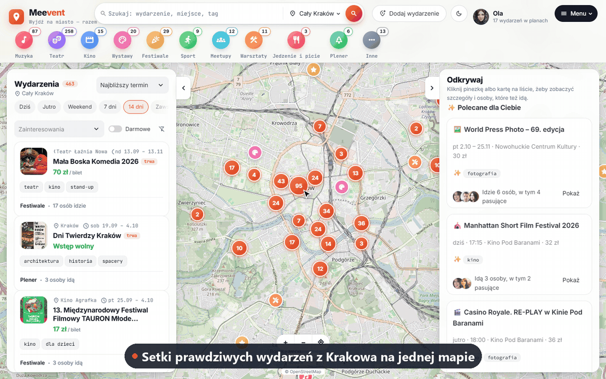
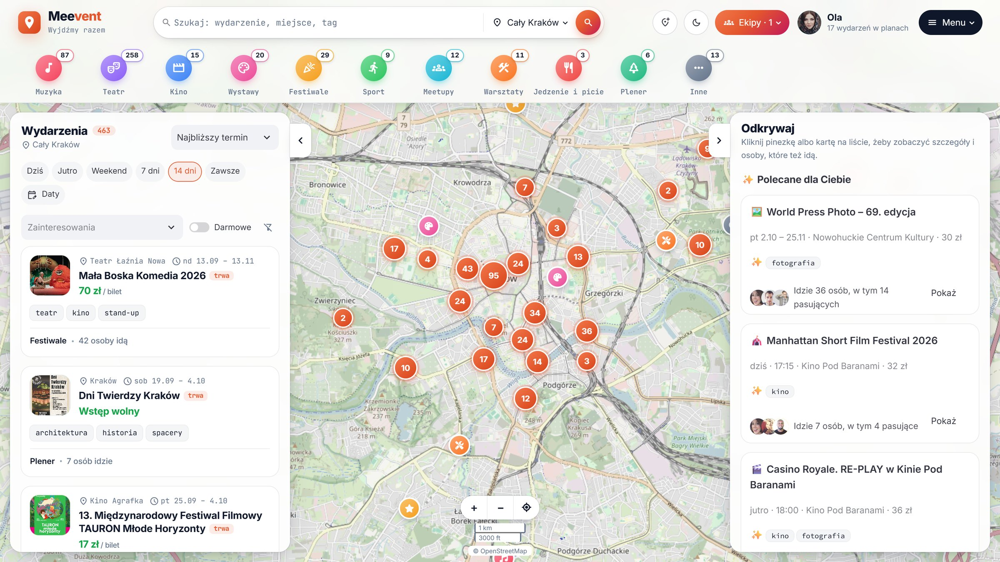
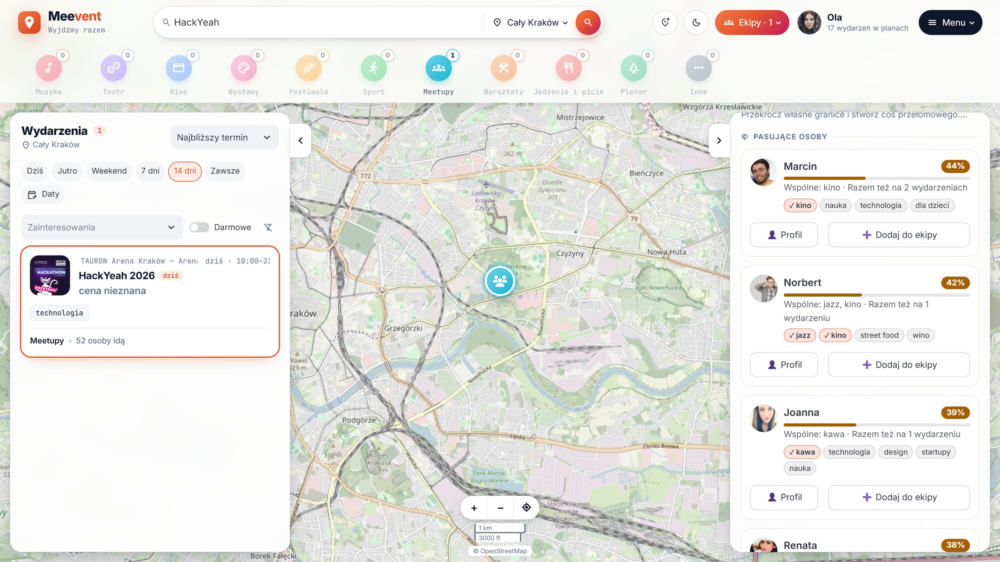
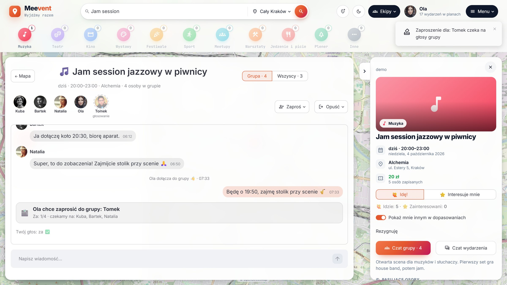
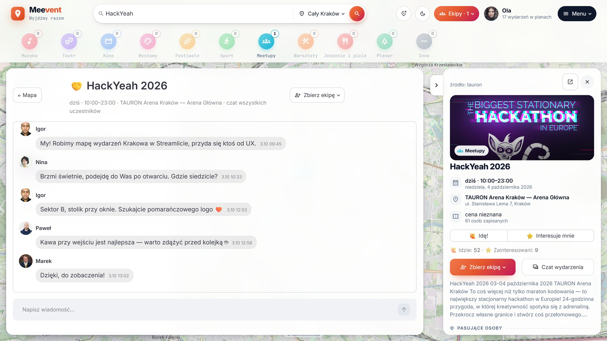
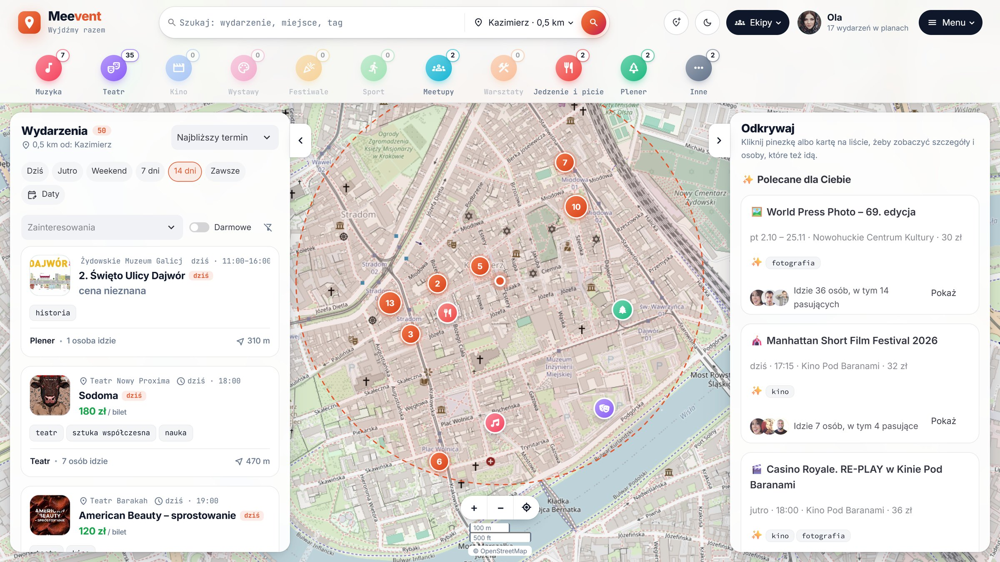
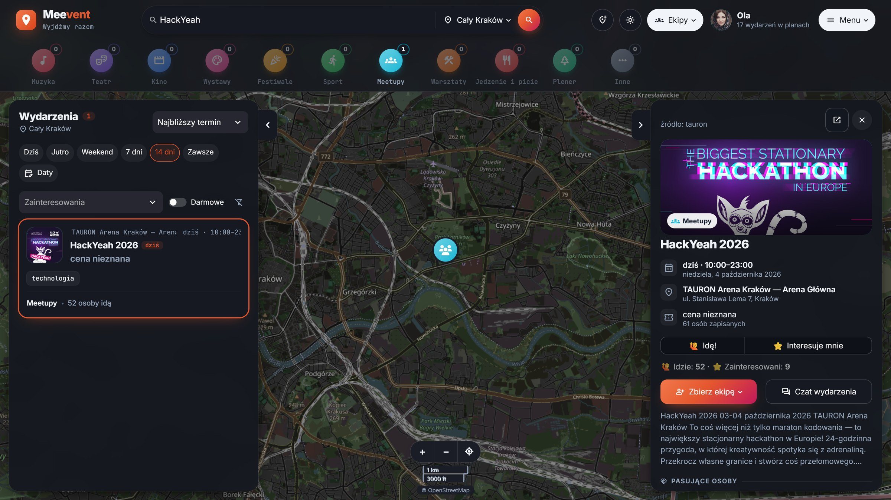
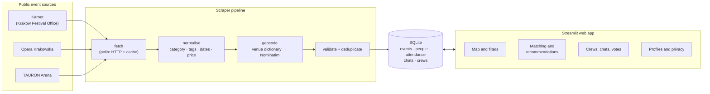

<h1 align="center">Meevent</h1>

<p align="center"><b>Don't skip the event because you have no one to go with.</b><br>
A social map of Kraków's events: see who else is going and go together.</p>

<p align="center"><i>HackYeah 2026 </i></p>

<p align="center">
  
</p>

<p align="center">
  
  
  
  
</p>

## The problem

Kraków runs **hundreds of cultural and social events every week**: concerts, exhibitions, theatre, meetups and
workshops. Yet many residents stay home:

- **The information is scattered** across the city calendar, venue websites and ticket portals.
- **"I'd go, but not alone."** Students, newcomers, expats and people whose friends have moved away have no
  one to go with.
- **Social apps don't fit this need.** They are built for dating or endless chatting, not for going somewhere
  together tonight.

As a result, the city's cultural offer, much of it free or publicly funded, is underused, small venues struggle
to fill seats, and people feel lonely in a city full of things to do.

## The solution

Meevent puts the city's events on one map and adds the missing piece: **the people.**

| 1. Discover | 2. Match | 3. Go together |
|---|---|---|
| About 700 real upcoming events from Kraków's public sources on one map, filtered by category, date, interests, price or neighbourhood. | Each event shows who is going and ranks the **people who share your interests**, with a % score and a plain reason ("Shared: jazz, photography"). | Form a small **crew** for the event. The **whole crew votes** on each new member, and the crew chat unlocks only after you join. |

Privacy comes first: for each event you choose whether others can see you in matches, and you can hide yourself
everywhere with one click.

**Who benefits:**
- **Residents** get a reason and a group to go out.
- **Venues and organisers** get fuller rooms, especially small ones.
- **The city** gets better use of its cultural offer and a picture of what residents actually attend.

## Highlights

<table>
  <tr>
    <td width="50%"><br>
      <b>The whole city on one map.</b> About 700 events, a category bar with live counts and "Recommended for
      you".</td>
    <td width="50%"><br>
      <b>Matching people.</b> Everyone going, ranked by shared interests, with the common tags highlighted.</td>
  </tr>
  <tr>
    <td><br>
      <b>Crews decide together.</b> Inviting someone starts a vote in the crew chat, and a single "no" rejects
      them.</td>
    <td><br>
      <b>Chat for everyone going</b>, here at HackYeah 2026 with 52 attendees: find each other at the venue.</td>
  </tr>
  <tr>
    <td><br>
      <b>Close to me.</b> Pick a neighbourhood or click any point on the map, and the results are limited to a
      radius around it.</td>
    <td><br>
      <b>Light and dark theme</b>, map included, switched with one click.</td>
  </tr>
</table>

Also in the app: profiles with interests and a photo, private 1:1 messages, a "Crews" inbox with invitations,
and adding your own event (it appears on the map immediately). More screenshots for slides are in
[`docs/screenshots/`](docs/screenshots/).

## Try it

You need **Python 3.10+**; setup takes about two minutes. Event data is bundled with the repo, but map tiles
and photos need an internet connection.

```bash
git clone https://github.com/klonicaWeronika/HackYeah26_event_app.git
cd HackYeah26_event_app
python -m venv .venv
.venv\Scripts\activate              # macOS/Linux: source .venv/bin/activate
pip install -r requirements.txt
streamlit run app.py
```

Open **http://localhost:8501**. Demo data loads automatically on first start, and there is no login: the user
is chosen in the URL.

**A 2-minute walkthrough** (the UI is in Polish, since its first users are Kraków residents):

1. Open `http://localhost:8501/?user=u_ola`. Ola has just moved to Kraków.
2. Click **Muzyka** and **Dziś** (Music, Today), then open *Jam session jazzowy w piwnicy*. On the right
   you see who is going and how well they match Ola.
3. Kuba has already invited Ola to his crew. Click **Zobacz zaproszenie** (See invitation), then **Dołącz**
   (Join): the crew chat unlocks.
4. Click **Zaproś** (Invite) and choose Tomek. A vote appears in the chat. Open
   `http://localhost:8501/?user=u_kuba` in a second tab. Click **Ekipy** (Crews), choose the pending vote and
   click **Za** (Yes). The count goes up in both tabs.
5. Click **← Mapa** to return to the map, clear the filters with the crossed-out funnel icon, and sort the
   list by **Najpopularniejsze** (Most popular). The top event is a real one, with dozens of attendees and a
   busy event chat.

To restore fresh demo data, run `python -m shared.storage --reset`.

## How it works



**Matching is explainable, not a black box.** Each score from 0 to 100% is a weighted sum of four signals:

| Signal | Weight | Meaning |
|---|---|---|
| Shared interests | 60% | Similarity of interest tags, where rare interests count more (sharing *opera* means more than sharing *music*) |
| Co-attendance | 20% | Other events you are both going to (only if both of you are visible) |
| Event fit | 10% | How well the person's interests fit this event |
| Status | 10% | "Going" counts more than "Interested" |

**It stays fast.** Data is read from an in-memory snapshot, the map does not reload when you move it, and
chats refresh only themselves every 2 seconds. Each interaction has a 300 ms budget, and matching is
benchmarked on 500 events × 200 people.

**Tech stack**: Python, Streamlit, folium (OpenStreetMap), Pydantic, SQLite, requests and BeautifulSoup, pytest.
The full technical design is in [ARCHITECTURE.md](ARCHITECTURE.md), in Polish.

## Data and ethics

| Source | Access | What it brings |
|---|---|---|
| [Karnet: Kraków Festival Office](https://karnet.krakowculture.pl/wydarzenia) | public HTML | ~97% of events, all kinds of culture |
| [Opera Krakowska](https://opera.krakow.pl/repertuar) | public JSON | opera, ballet, concerts |
| [TAURON Arena Kraków](https://www.tauronarenakrakow.pl/wydarzenia/) | public REST API | big concerts, sport, conferences |

The scrapers identify themselves, wait at least 1 second between requests, respect `robots.txt` and cache
responses. They never bypass logins, CAPTCHAs or bot protection. A snapshot of the data (taken on
3 October 2026) ships with the repo, so the demo does not depend on these websites being available. Only events
that haven't ended are loaded, so the snapshot shrinks over time. To fetch fresh events (needs internet), run
`python -m m2_scraper.run --source all`.

> **All people, profiles, chats and crews in the demo are fictional.** Only the events are real.

## What we built during HackYeah

The project was built from scratch during the hackathon. The git history starts at kickoff on 3 October 2026.

- [x] Scrapers for 3 sources with normalisation, geocoding, de-duplication and an offline snapshot
- [x] Full-screen map with category counts, filters, sorting, neighbourhood and radius search
- [x] Explainable people matching and personal event recommendations
- [x] "Going!" and "Interested", crews with invitations and group voting, event chats and private messages,
      inbox and notifications
- [x] Profiles with photo upload, interests and privacy controls
- [x] Adding your own events, light and dark theme
- [x] 641 automated tests, including smoke tests that render the whole app

**Next steps:**
- Real accounts and moderation.
- More sources: city institutions, NGOs and universities.
- Accessibility filters and public transport directions.
- A mobile version (PWA).
- Anonymous attendance insights for the city and venues.

## Repository structure

The app is split into five modules, one per team member, that share a common data contract in `shared/`:

| Module | Folder | Responsibility |
|---|---|---|
| M1 Map & layout | `m1_ui_map/`, `app.py` | Map, panels, filters, top bar, theme, integration |
| M2 Data | `m2_scraper/` | Scrapers, data cleaning, geocoding, "Add event" form |
| M3 Profiles | `m3_profile/` | Profiles, photos, person cards, privacy |
| M4 Matching | `m4_matching/` | Similarity, matches, recommendations |
| M5 Social | `m5_chat/` | Attendance, chats, crews, invitations, votes |

Run `pytest` to execute the test suite, which takes about 40 seconds.

## Use of AI and external resources

As the HackYeah rules require, we disclose the following:

- **AI-assisted development**: we used AI coding assistants (Claude Code) for implementation, tests,
  documentation and the README media. The prompts we used for each module are in `m*/AGENT_PROMPT.md`.
  The team designed the architecture and the module split and reviewed and integrated the code.
- **Data**: event data comes from the public sources listed above. Map tiles: © OpenStreetMap contributors.
  Geocoding: Nominatim.
- **Images**: demo avatars come from [pravatar.cc](https://pravatar.cc) and [randomuser.me](https://randomuser.me).
  Event photos are loaded from the sources' own servers and are not stored in this repo.
- **Libraries and fonts**: the open-source Python libraries listed in `requirements.txt`, the Inter and
  JetBrains Mono fonts, and Material Symbols.

## License

[MIT](LICENSE)
