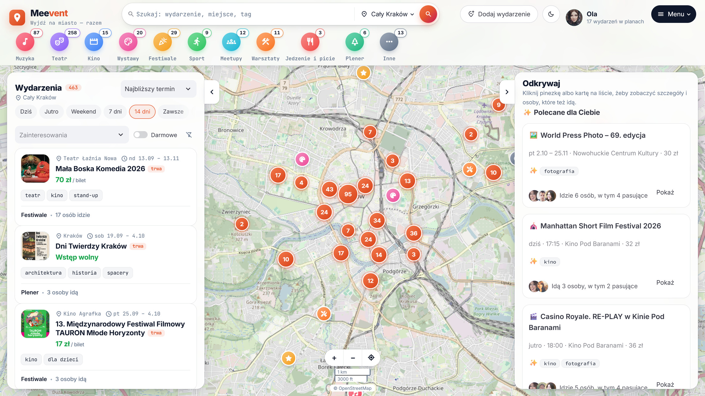
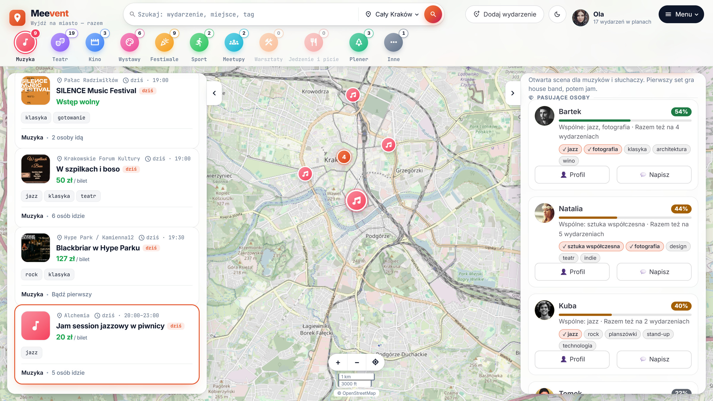
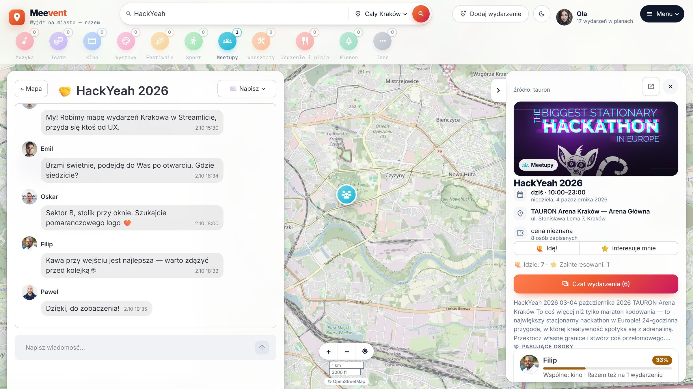
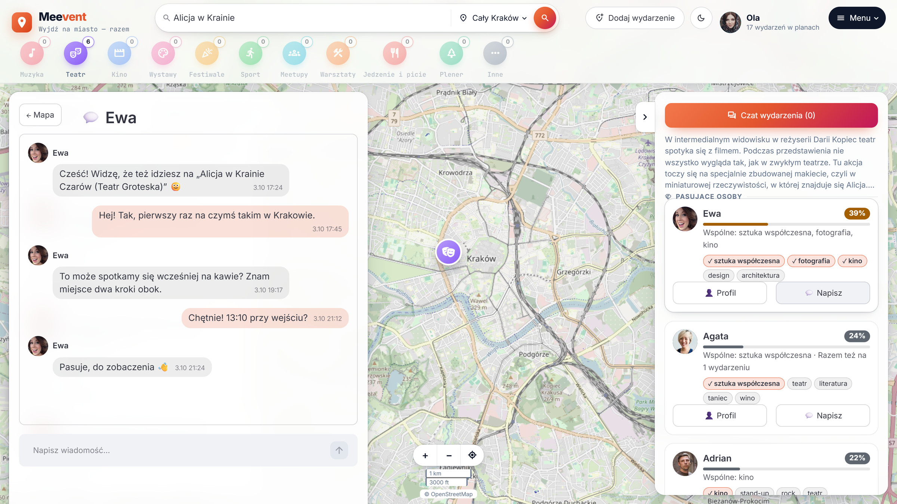
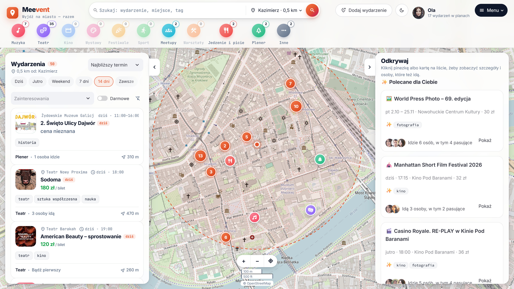
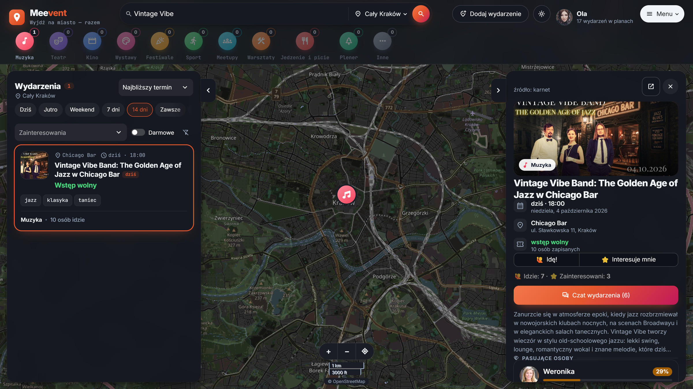

# Meevent — HackYeah 2026

<p align="center">
  
</p>

Wspólne wyjścia na wydarzenia kulturalne i społeczne w Krakowie: **mapa wydarzeń → osoby o podobnych zainteresowaniach, które też idą → czat.**
Python + Streamlit, MVP na 24-godzinny hackathon (5 osób).

## Start w 2 minuty

```bash
python -m venv .venv
.venv\Scripts\activate            # macOS/Linux: source .venv/bin/activate
pip install -r requirements.txt
streamlit run app.py
```

Baza `data/app.db` tworzy się sama i ładuje dane demo — bez internetu i bez scrapowania:

| Warstwa | Skąd | Co daje |
|---|---|---|
| Mocki | `shared/mock_data.py` | 36 wydarzeń w prawdziwych miejscach Krakowa, 12 person do scenariusza demo |
| Prawdziwe wydarzenia | `data/seed_events.json` (snapshot scrapera M2: Karnet, Opera, TAURON Arena) | ~680 nadchodzących wydarzeń z opisami, cenami i zdjęciami |
| Przykładowa społeczność | `shared/example_data.py` | 28 fikcyjnych osób zapisanych na prawdziwe wydarzenia (dobór po zainteresowaniach), czaty najpopularniejszych wydarzeń i prywatne rozmowy Oli i Kuby |

Dwie osoby naraz (demo czatu): `http://localhost:8501/?user=u_ola` i `http://localhost:8501/?user=u_kuba`.

```bash
pytest                              # wszystkie testy + smoke test aplikacji i sandboxów
python -m shared.storage --reset    # świeże dane demo (daty liczone od dziś)
python -m shared.storage --example  # dołóż przykładową społeczność do istniejącej bazy (bez kasowania)
```

## Zrzuty ekranu

Pełna galeria (2400×1350, do prezentacji): [docs/screenshots/](docs/screenshots/).

| | |
|---|---|
|  **Mapa** — setki wydarzeń, kategorie z licznikami, polecane dla Ciebie |  **Pasujące osoby** — kto jeszcze idzie i co Was łączy |
|  **Czat wydarzenia** — umówcie się przed wejściem |  **Wiadomość prywatna** — 1:1 z dopasowaną osobą |
|  **Okolica i promień** — tylko to, co blisko |  **Tryb ciemny** — przełącznik ☾/☀ w górnym pasku (domyślnie motyw systemu) |

## Dokumentacja

- [ARCHITECTURE.md](ARCHITECTURE.md) — architektura end-to-end, przepływ danych i stanów, podział zadań, harmonogram 24 h, scenariusz demo.
- [docs/TASK_SPEC_TEMPLATE.md](docs/TASK_SPEC_TEMPLATE.md) — szablon specyfikacji modułu.
- `m*/AGENT_PROMPT.md` — gotowe prompty dla agenta AI (Claude Code itp.): prompt startowy, prompt na kolejne zadanie, a w M1 także prompt integracyjny na checkpointy.

| Moduł | Folder | Specyfikacja | Sandbox |
|---|---|---|---|
| M1 Layout & Mapa (+ integracja) | `m1_ui_map/` | [TASK_SPEC](m1_ui_map/TASK_SPEC.md) | `streamlit run app.py` |
| M2 Scraper & zasilanie bazy | `m2_scraper/` | [TASK_SPEC](m2_scraper/TASK_SPEC.md) | `streamlit run m2_scraper/sandbox.py` |
| M3 Profil & stan sesji | `m3_profile/` | [TASK_SPEC](m3_profile/TASK_SPEC.md) | `streamlit run m3_profile/sandbox.py` |
| M4 Matching & rekomendacje | `m4_matching/` | [TASK_SPEC](m4_matching/TASK_SPEC.md) | `streamlit run m4_matching/sandbox.py` |
| M5 Czat & interakcje | `m5_chat/` | [TASK_SPEC](m5_chat/TASK_SPEC.md) | `streamlit run m5_chat/sandbox.py` |

Wspólny kontrakt: `shared/models.py` (modele), `shared/storage.py` (DAO), `shared/state.py` (stan sesji), `shared/mock_data.py` (dane demo), `shared/example_data.py` (społeczność na prawdziwych wydarzeniach).
